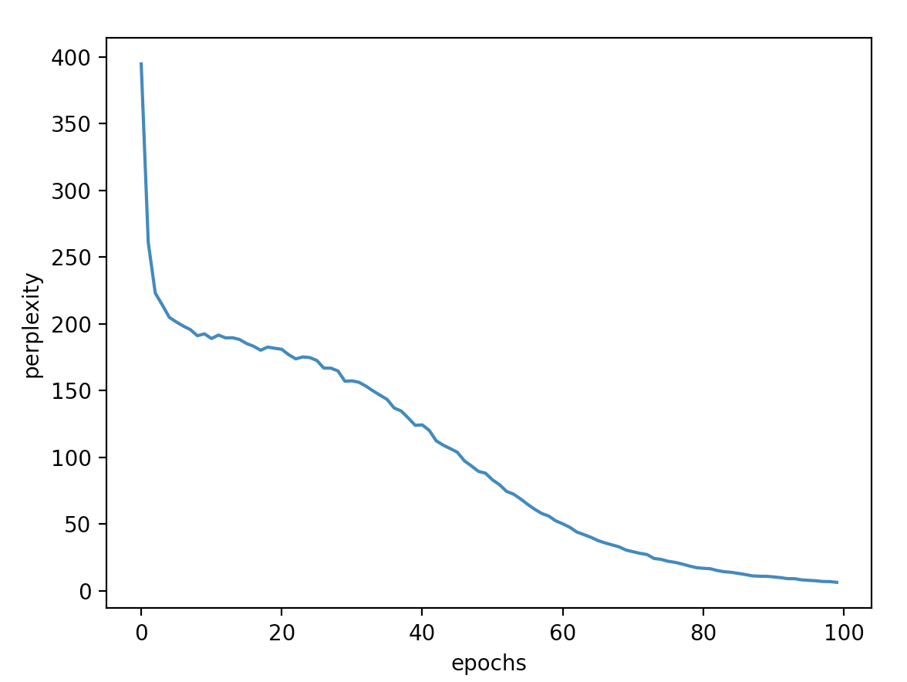

# Ch 05 - 순환 신경망(RNN)


### 1. rnnlm_gen.py


- Score 의 shape : (1, 1, 10000) → Ex)  [[[-0.00445436 -0.00227842 -0.0010397  ... -0.00125923 -0.00101773
      0.00159206]]]

-  x 의 shape : (1, 1) → Ex) [4601]

- word_ids  : [316, 9098, 7157, 812, 2012, 4840, 9968, 3256, 3481, 9036, 3712, 3449, 9194, 2952, 7815, 5157, 2421, 5419, 7869, 3873, 567, 2975, 7602, 5335, 996, 3106, 8574, 8478, 6506, 2956, 7106, 5674, 3621, 7979, 2226, 7431, 1066, 9531, 2116, 9067, 2229, 1803, 6676, 6576, 7003, 127, 3443, 946, 6273, 9030, 7128, 9311, 9150, 2277, 7212, 5168, 4414, 8244, 263, 4131, 6017, 3235, 6653, 8371, 7253, 2009, 1582, 5716, 5218, 1090, 8508, 7783, 2172, 6449, 9710, 4510, 2659, 6764, 3285, 1964, 7597, 9001, 1147, 774, 3788, 7101, 1064, 8632, 2655, 9558, 4331, 6653, 3133, 6015, 1327, 2077, 4289, 4809, 4904, 2375]

  → id 에 해당하는 word 로 바꿔주며 문장을 생성한다.

- 각 단어의 점수들을 softmax (p.reshape(100, 100))

  ```python
  각 단어 확률 정규화 :  [[1.00272984e-04 1.00376761e-04 1.00181780e-04 ... 9.96126982e-05
    1.00087229e-04 1.00267614e-04]
   [1.00199562e-04 1.00200094e-04 1.00209174e-04 ... 9.98907781e-05
    1.00042227e-04 9.97550669e-05]
   [1.00354620e-04 1.00105142e-04 1.00523204e-04 ... 9.98831747e-05
    1.00668069e-04 1.00727746e-04]
   ...
   [1.00389494e-04 9.99821787e-05 9.98417090e-05 ... 9.99552940e-05
    1.00009362e-04 9.99937838e-05]
   [1.00048244e-04 1.00146724e-04 1.00285157e-04 ... 9.99937256e-05
    9.98443647e-05 9.97578536e-05]
   [9.96107119e-05 1.00637844e-04 9.99856711e-05 ... 1.00456797e-04
    9.98362593e-05 1.00497011e-04]]
  ```

- sampled : 확률 분포 p 로부터 **다음 단어**를 샘플링

  ```python
  sampled = np.random.choice(len(p), size=1, p=p)     # 확률분포 p 로부터 다음 단어를 샘플링한다.
  sampled :  [1937]
  sampled :  [4897]
  sampled :  [4022]
  sampled :  [4469]
  sampled :  [7780]
  sampled :  [1945]
  sampled :  [5348]
  sampled :  [2594]
  sampled :  [4379]
  sampled :  [4530]
  sampled :  [6426]
  sampled :  [798]
  sampled :  [7684]
  sampled :  [148]
  sampled :  [7772]
  sampled :  [1971]
  sampled :  [396]
  sampled :  [4118]
  sampled :  [8253]
  sampled :  [8791]
  sampled :  [836]
  sampled :  [6660]
  sampled :  [2804]
  sampled :  [429]
  sampled :  [6645]
  sampled :  [9452]
  sampled :  [9984]
  sampled :  [1399]
  sampled :  [594]
  sampled :  [2694]
  sampled :  [6865]
  sampled :  [7909]
  sampled :  [2151]
  sampled :  [1815]
  sampled :  [4660]
  sampled :  [4220]
  sampled :  [7886]
  sampled :  [7729]
  sampled :  [870]
  sampled :  [3523]
  sampled :  [9543]
  sampled :  [2663]
  sampled :  [4639]
  sampled :  [1219]
  sampled :  [9307]
  sampled :  [5883]
  sampled :  [108]
  sampled :  [8343]
  sampled :  [310]
  sampled :  [6574]
  sampled :  [8020]
  sampled :  [9371]
  sampled :  [7496]
  sampled :  [5327]
  sampled :  [5935]
  sampled :  [2777]
  sampled :  [8060]
  sampled :  [6012]
  sampled :  [3237]
  sampled :  [1236]
  sampled :  [4130]
  sampled :  [6584]
  sampled :  [8048]
  sampled :  [1200]
  sampled :  [8653]
  sampled :  [2153]
  sampled :  [509]
  sampled :  [9779]
  sampled :  [5194]
  sampled :  [103]
  sampled :  [8156]
  sampled :  [9449]
  sampled :  [365]
  sampled :  [7387]
  sampled :  [3741]
  sampled :  [2173]
  sampled :  [6061]
  sampled :  [2090]
  sampled :  [1406]
  sampled :  [6128]
  sampled :  [8064]
  sampled :  [2783]
  sampled :  [5102]
  sampled :  [3300]
  sampled :  [4701]
  sampled :  [2933]
  sampled :  [1248]
  sampled :  [1492]
  sampled :  [7910]
  sampled :  [8256]
  sampled :  [1604]
  sampled :  [771]
  sampled :  [3467]
  sampled :  [9768]
  sampled :  [3327]
  sampled :  [1917]
  sampled :  [8677]
  sampled :  [9587]
  sampled :  [1490]
  ```

- np.random.choice(len(p), size = 1, p=p)

  - len(p) : 1차원 배열 또는 정수 👉 **배열 p 의 요소 중** 
  - size = 1 : 정수 또는 튜플(튜플인 경우 행렬로 리턴) 👉 **1개를 출력한다.**
  - p = p : 1차원 배열, 각 데이터가 선택될 확률 👉 **배열 p 에서 각 데이터의 확률 (확률의 합은 1이 되어야 함)**

### 2. Simple_rnnlm.py

4개의 Time 계층을 쌓은 신경망

- 초기화 메서드 : 각 계층에서 사용하는 매개변수(가중치/편향)를 초기화, 필요한 계층 생성
- Truncated BPTT 로 학습한다고 가정
- Time RNN 계층의 stateful = True → 이전 시각의 은닉 상태 계승 
- 초기화 (RNN, Affine 계층) → Xavier 초깃값 (사비에르 초깃값) 이용
- forward(), backward() : 각각의 계층에서 순전파/역전파 메서드 호출


### 3. 언어 모델의 평가 - 퍼플렉서티(Perplexity)

- **언어 모델의 예측 성능을 평가하는 척도**

- 간단히 말하면 '확률의 역수'

- 언어 모델은 주어진 과거 단어(정보)로 부터 다음에 출현할 단어의 확률분포를 출력한다.

  'you say goodbye and I say hello .'

  

  - 모델 1 : 0.8의 역수 → 1.25 ➡️ 단어 후보를 1개 정도로 좁혔다
  - 모델 2 : 0.2의 역수 → 5 ➡️ 단어 후보가 아직 5개나 된다.

  👉 **퍼플렉서티는 작을수록 좋다**

  👉 1.25, 5 라는 값은 '분기수' 로 해석할 수 있다. 분기 수란 다음에 취할 수 있는 선택사항의 수(구체적으로 말하면, 다음에 출현할 수 있는 단어의 후보 수)

- 입력 데이터가 여러 개 일 때 공식

  

  

### 4. train_custom_loop.py

- PTB 데이터셋 1000개만 이용하여 학습을 수행

  ```python
  말뭉치 크기: 1000, 어휘 수: 418
  | 에폭 1 | 퍼플렉서티 394.87
  | 에폭 2 | 퍼플렉서티 261.20
  | 에폭 3 | 퍼플렉서티 223.07
  | 에폭 4 | 퍼플렉서티 214.22
  | 에폭 5 | 퍼플렉서티 204.89
  | 에폭 6 | 퍼플렉서티 201.40
  | 에폭 7 | 퍼플렉서티 198.34
  | 에폭 8 | 퍼플렉서티 195.66
  | 에폭 9 | 퍼플렉서티 191.12
  | 에폭 10 | 퍼플렉서티 192.54
  | 에폭 11 | 퍼플렉서티 189.02
  | 에폭 12 | 퍼플렉서티 191.62
  | 에폭 13 | 퍼플렉서티 189.49
  | 에폭 14 | 퍼플렉서티 189.60
  | 에폭 15 | 퍼플렉서티 188.29
  | 에폭 16 | 퍼플렉서티 185.26
  | 에폭 17 | 퍼플렉서티 183.22
  | 에폭 18 | 퍼플렉서티 180.24
  | 에폭 19 | 퍼플렉서티 182.63
  | 에폭 20 | 퍼플렉서티 181.71
  | 에폭 21 | 퍼플렉서티 180.96
  | 에폭 22 | 퍼플렉서티 176.85
  | 에폭 23 | 퍼플렉서티 173.78
  | 에폭 24 | 퍼플렉서티 175.22
  | 에폭 25 | 퍼플렉서티 174.73
  | 에폭 26 | 퍼플렉서티 172.57
  | 에폭 27 | 퍼플렉서티 166.85
  | 에폭 28 | 퍼플렉서티 166.82
  | 에폭 29 | 퍼플렉서티 164.72
  | 에폭 30 | 퍼플렉서티 157.00
  | 에폭 31 | 퍼플렉서티 157.29
  | 에폭 32 | 퍼플렉서티 156.21
  | 에폭 33 | 퍼플렉서티 153.29
  | 에폭 34 | 퍼플렉서티 149.77
  | 에폭 35 | 퍼플렉서티 146.53
  | 에폭 36 | 퍼플렉서티 143.40
  | 에폭 37 | 퍼플렉서티 136.98
  | 에폭 38 | 퍼플렉서티 134.71
  | 에폭 39 | 퍼플렉서티 129.50
  | 에폭 40 | 퍼플렉서티 123.97
  | 에폭 41 | 퍼플렉서티 124.29
  | 에폭 42 | 퍼플렉서티 120.15
  | 에폭 43 | 퍼플렉서티 112.28
  | 에폭 44 | 퍼플렉서티 109.05
  | 에폭 45 | 퍼플렉서티 106.49
  | 에폭 46 | 퍼플렉서티 103.77
  | 에폭 47 | 퍼플렉서티 97.37
  | 에폭 48 | 퍼플렉서티 93.53
  | 에폭 49 | 퍼플렉서티 89.45
  | 에폭 50 | 퍼플렉서티 88.10
  | 에폭 51 | 퍼플렉서티 83.08
  | 에폭 52 | 퍼플렉서티 79.46
  | 에폭 53 | 퍼플렉서티 74.45
  | 에폭 54 | 퍼플렉서티 72.39
  | 에폭 55 | 퍼플렉서티 68.79
  | 에폭 56 | 퍼플렉서티 64.76
  | 에폭 57 | 퍼플렉서티 61.09
  | 에폭 58 | 퍼플렉서티 57.91
  | 에폭 59 | 퍼플렉서티 55.97
  | 에폭 60 | 퍼플렉서티 52.38
  | 에폭 61 | 퍼플렉서티 50.14
  | 에폭 62 | 퍼플렉서티 47.55
  | 에폭 63 | 퍼플렉서티 44.00
  | 에폭 64 | 퍼플렉서티 42.06
  | 에폭 65 | 퍼플렉서티 40.07
  | 에폭 66 | 퍼플렉서티 37.61
  | 에폭 67 | 퍼플렉서티 35.86
  | 에폭 68 | 퍼플렉서티 34.37
  | 에폭 69 | 퍼플렉서티 32.90
  | 에폭 70 | 퍼플렉서티 30.48
  | 에폭 71 | 퍼플렉서티 29.21
  | 에폭 72 | 퍼플렉서티 28.01
  | 에폭 73 | 퍼플렉서티 27.11
  | 에폭 74 | 퍼플렉서티 24.16
  | 에폭 75 | 퍼플렉서티 23.48
  | 에폭 76 | 퍼플렉서티 22.05
  | 에폭 77 | 퍼플렉서티 21.23
  | 에폭 78 | 퍼플렉서티 19.98
  | 에폭 79 | 퍼플렉서티 18.57
  | 에폭 80 | 퍼플렉서티 17.29
  | 에폭 81 | 퍼플렉서티 16.79
  | 에폭 82 | 퍼플렉서티 16.47
  | 에폭 83 | 퍼플렉서티 15.12
  | 에폭 84 | 퍼플렉서티 14.23
  | 에폭 85 | 퍼플렉서티 13.78
  | 에폭 86 | 퍼플렉서티 12.97
  | 에폭 87 | 퍼플렉서티 12.12
  | 에폭 88 | 퍼플렉서티 11.11
  | 에폭 89 | 퍼플렉서티 10.86
  | 에폭 90 | 퍼플렉서티 10.80
  | 에폭 91 | 퍼플렉서티 10.35
  | 에폭 92 | 퍼플렉서티 9.79
  | 에폭 93 | 퍼플렉서티 9.05
  | 에폭 94 | 퍼플렉서티 9.00
  | 에폭 95 | 퍼플렉서티 8.12
  | 에폭 96 | 퍼플렉서티 7.78
  | 에폭 97 | 퍼플렉서티 7.46
  | 에폭 98 | 퍼플렉서티 6.92
  | 에폭 99 | 퍼플렉서티 6.82
  | 에폭 100 | 퍼플렉서티 6.28
  ```

- Perplexity 계산

  

  

