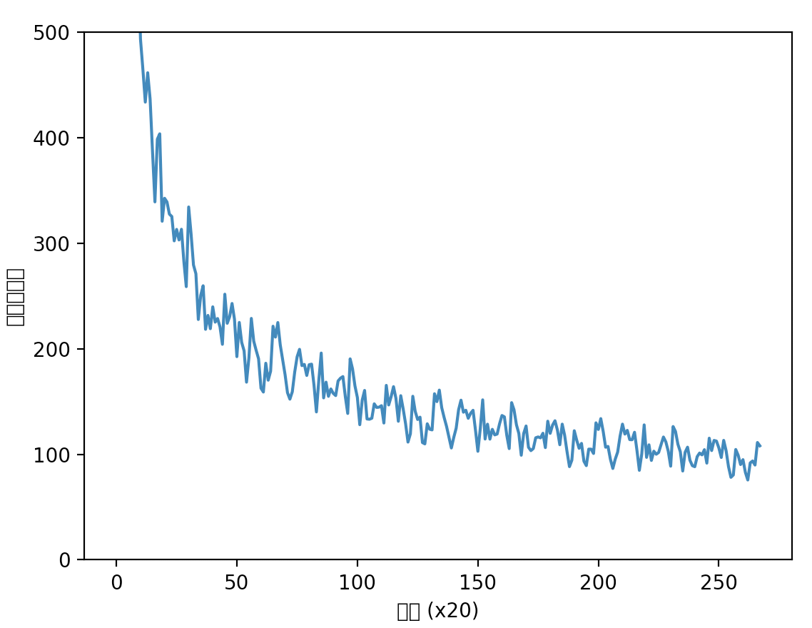

# Ch06 - 게이트가 추가된 RNN


1. train_rnnlm.py

- RNNLM 학습 코드 실행 (이 파일을 다음 장에서 학습된 가중치 매개변수를 사용해 문장을 생성할 때 사용함)

  ```
  | 에폭 1 |  반복 1 / 1327 | 시간 0[s] | 퍼플렉서티 10001.42
  | 에폭 1 |  반복 21 / 1327 | 시간 4[s] | 퍼플렉서티 2658.94
  | 에폭 1 |  반복 41 / 1327 | 시간 9[s] | 퍼플렉서티 1202.81
  | 에폭 1 |  반복 61 / 1327 | 시간 13[s] | 퍼플렉서티 959.04
  | 에폭 1 |  반복 81 / 1327 | 시간 18[s] | 퍼플렉서티 774.81
  | 에폭 1 |  반복 101 / 1327 | 시간 23[s] | 퍼플렉서티 639.65
  | 에폭 1 |  반복 121 / 1327 | 시간 27[s] | 퍼플렉서티 623.48
  | 에폭 1 |  반복 141 / 1327 | 시간 32[s] | 퍼플렉서티 587.66
  | 에폭 1 |  반복 161 / 1327 | 시간 36[s] | 퍼플렉서티 578.37
  | 에폭 1 |  반복 181 / 1327 | 시간 41[s] | 퍼플렉서티 579.76
  | 에폭 1 |  반복 201 / 1327 | 시간 46[s] | 퍼플렉서티 493.66
  | 에폭 1 |  반복 221 / 1327 | 시간 50[s] | 퍼플렉서티 464.87
  | 에폭 1 |  반복 241 / 1327 | 시간 55[s] | 퍼플렉서티 433.80
  | 에폭 1 |  반복 261 / 1327 | 시간 59[s] | 퍼플렉서티 461.63
  | 에폭 1 |  반복 281 / 1327 | 시간 64[s] | 퍼플렉서티 436.77
  | 에폭 1 |  반복 301 / 1327 | 시간 68[s] | 퍼플렉서티 386.73
  | 에폭 1 |  반복 321 / 1327 | 시간 73[s] | 퍼플렉서티 339.22
  | 에폭 1 |  반복 341 / 1327 | 시간 78[s] | 퍼플렉서티 398.63
  | 에폭 1 |  반복 361 / 1327 | 시간 83[s] | 퍼플렉서티 403.76
  | 에폭 1 |  반복 381 / 1327 | 시간 87[s] | 퍼플렉서티 320.89
  | 에폭 1 |  반복 401 / 1327 | 시간 92[s] | 퍼플렉서티 342.64
  | 에폭 1 |  반복 421 / 1327 | 시간 96[s] | 퍼플렉서티 339.12
  | 에폭 1 |  반복 441 / 1327 | 시간 101[s] | 퍼플렉서티 327.63
  | 에폭 1 |  반복 461 / 1327 | 시간 106[s] | 퍼플렉서티 325.41
  | 에폭 1 |  반복 481 / 1327 | 시간 110[s] | 퍼플렉서티 302.28
  | 에폭 1 |  반복 501 / 1327 | 시간 115[s] | 퍼플렉서티 313.15
  | 에폭 1 |  반복 521 / 1327 | 시간 119[s] | 퍼플렉서티 303.10
  | 에폭 1 |  반복 541 / 1327 | 시간 124[s] | 퍼플렉서티 313.27
  | 에폭 1 |  반복 561 / 1327 | 시간 128[s] | 퍼플렉서티 282.99
  | 에폭 1 |  반복 581 / 1327 | 시간 133[s] | 퍼플렉서티 258.90
  | 에폭 1 |  반복 601 / 1327 | 시간 137[s] | 퍼플렉서티 334.39
  | 에폭 1 |  반복 621 / 1327 | 시간 142[s] | 퍼플렉서티 308.90
  | 에폭 1 |  반복 641 / 1327 | 시간 147[s] | 퍼플렉서티 279.41
  | 에폭 1 |  반복 661 / 1327 | 시간 151[s] | 퍼플렉서티 271.13
  | 에폭 1 |  반복 681 / 1327 | 시간 156[s] | 퍼플렉서티 227.76
  | 에폭 1 |  반복 701 / 1327 | 시간 160[s] | 퍼플렉서티 250.59
  | 에폭 1 |  반복 721 / 1327 | 시간 165[s] | 퍼플렉서티 259.73
  | 에폭 1 |  반복 741 / 1327 | 시간 169[s] | 퍼플렉서티 218.43
  | 에폭 1 |  반복 761 / 1327 | 시간 174[s] | 퍼플렉서티 231.62
  | 에폭 1 |  반복 781 / 1327 | 시간 178[s] | 퍼플렉서티 219.06
  | 에폭 1 |  반복 801 / 1327 | 시간 183[s] | 퍼플렉서티 239.75
  | 에폭 1 |  반복 821 / 1327 | 시간 187[s] | 퍼플렉서티 225.24
  | 에폭 1 |  반복 841 / 1327 | 시간 192[s] | 퍼플렉서티 228.66
  | 에폭 1 |  반복 861 / 1327 | 시간 196[s] | 퍼플렉서티 220.73
  | 에폭 1 |  반복 881 / 1327 | 시간 201[s] | 퍼플렉서티 204.22
  | 에폭 1 |  반복 901 / 1327 | 시간 205[s] | 퍼플렉서티 251.73
  | 에폭 1 |  반복 921 / 1327 | 시간 210[s] | 퍼플렉서티 224.16
  | 에폭 1 |  반복 941 / 1327 | 시간 214[s] | 퍼플렉서티 230.37
  | 에폭 1 |  반복 961 / 1327 | 시간 219[s] | 퍼플렉서티 242.93
  | 에폭 1 |  반복 981 / 1327 | 시간 224[s] | 퍼플렉서티 228.10
  | 에폭 1 |  반복 1001 / 1327 | 시간 228[s] | 퍼플렉서티 192.55
  | 에폭 1 |  반복 1021 / 1327 | 시간 233[s] | 퍼플렉서티 224.95
  | 에폭 1 |  반복 1041 / 1327 | 시간 237[s] | 퍼플렉서티 206.02
  | 에폭 1 |  반복 1061 / 1327 | 시간 242[s] | 퍼플렉서티 198.02
  | 에폭 1 |  반복 1081 / 1327 | 시간 246[s] | 퍼플렉서티 168.34
  | 에폭 1 |  반복 1101 / 1327 | 시간 251[s] | 퍼플렉서티 191.45
  | 에폭 1 |  반복 1121 / 1327 | 시간 255[s] | 퍼플렉서티 228.78
  | 에폭 1 |  반복 1141 / 1327 | 시간 260[s] | 퍼플렉서티 207.18
  | 에폭 1 |  반복 1161 / 1327 | 시간 264[s] | 퍼플렉서티 198.51
  | 에폭 1 |  반복 1181 / 1327 | 시간 269[s] | 퍼플렉서티 190.53
  | 에폭 1 |  반복 1201 / 1327 | 시간 273[s] | 퍼플렉서티 162.64
  | 에폭 1 |  반복 1221 / 1327 | 시간 278[s] | 퍼플렉서티 158.98
  | 에폭 1 |  반복 1241 / 1327 | 시간 282[s] | 퍼플렉서티 186.28
  | 에폭 1 |  반복 1261 / 1327 | 시간 287[s] | 퍼플렉서티 170.21
  | 에폭 1 |  반복 1281 / 1327 | 시간 291[s] | 퍼플렉서티 178.75
  | 에폭 1 |  반복 1301 / 1327 | 시간 296[s] | 퍼플렉서티 221.37
  | 에폭 1 |  반복 1321 / 1327 | 시간 300[s] | 퍼플렉서티 211.08
  | 에폭 2 |  반복 1 / 1327 | 시간 302[s] | 퍼플렉서티 224.87
  | 에폭 2 |  반복 21 / 1327 | 시간 307[s] | 퍼플렉서티 203.72
  | 에폭 2 |  반복 41 / 1327 | 시간 311[s] | 퍼플렉서티 189.42
  | 에폭 2 |  반복 61 / 1327 | 시간 316[s] | 퍼플렉서티 175.49
  | 에폭 2 |  반복 81 / 1327 | 시간 320[s] | 퍼플렉서티 158.40
  | 에폭 2 |  반복 101 / 1327 | 시간 325[s] | 퍼플렉서티 152.24
  | 에폭 2 |  반복 121 / 1327 | 시간 329[s] | 퍼플렉서티 159.21
  | 에폭 2 |  반복 141 / 1327 | 시간 334[s] | 퍼플렉서티 177.95
  | 에폭 2 |  반복 161 / 1327 | 시간 338[s] | 퍼플렉서티 192.44
  | 에폭 2 |  반복 181 / 1327 | 시간 343[s] | 퍼플렉서티 199.48
  | 에폭 2 |  반복 201 / 1327 | 시간 348[s] | 퍼플렉서티 184.02
  | 에폭 2 |  반복 221 / 1327 | 시간 352[s] | 퍼플렉서티 185.19
  | 에폭 2 |  반복 241 / 1327 | 시간 357[s] | 퍼플렉서티 174.71
  | 에폭 2 |  반복 261 / 1327 | 시간 361[s] | 퍼플렉서티 184.92
  | 에폭 2 |  반복 281 / 1327 | 시간 366[s] | 퍼플렉서티 185.43
  | 에폭 2 |  반복 301 / 1327 | 시간 370[s] | 퍼플렉서티 165.61
  | 에폭 2 |  반복 321 / 1327 | 시간 375[s] | 퍼플렉서티 140.15
  | 에폭 2 |  반복 341 / 1327 | 시간 379[s] | 퍼플렉서티 170.25
  | 에폭 2 |  반복 361 / 1327 | 시간 384[s] | 퍼플렉서티 195.94
  | 에폭 2 |  반복 381 / 1327 | 시간 389[s] | 퍼플렉서티 153.44
  | 에폭 2 |  반복 401 / 1327 | 시간 393[s] | 퍼플렉서티 168.34
  | 에폭 2 |  반복 421 / 1327 | 시간 398[s] | 퍼플렉서티 154.92
  | 에폭 2 |  반복 441 / 1327 | 시간 402[s] | 퍼플렉서티 161.92
  | 에폭 2 |  반복 461 / 1327 | 시간 407[s] | 퍼플렉서티 157.72
  | 에폭 2 |  반복 481 / 1327 | 시간 411[s] | 퍼플렉서티 155.63
  | 에폭 2 |  반복 501 / 1327 | 시간 416[s] | 퍼플렉서티 169.50
  | 에폭 2 |  반복 521 / 1327 | 시간 420[s] | 퍼플렉서티 172.15
  | 에폭 2 |  반복 541 / 1327 | 시간 425[s] | 퍼플렉서티 173.65
  | 에폭 2 |  반복 561 / 1327 | 시간 429[s] | 퍼플렉서티 154.63
  | 에폭 2 |  반복 581 / 1327 | 시간 434[s] | 퍼플렉서티 138.70
  | 에폭 2 |  반복 601 / 1327 | 시간 438[s] | 퍼플렉서티 190.43
  | 에폭 2 |  반복 621 / 1327 | 시간 443[s] | 퍼플렉서티 180.88
  | 에폭 2 |  반복 641 / 1327 | 시간 447[s] | 퍼플렉서티 164.76
  | 에폭 2 |  반복 661 / 1327 | 시간 452[s] | 퍼플렉서티 153.84
  | 에폭 2 |  반복 681 / 1327 | 시간 457[s] | 퍼플렉서티 128.03
  | 에폭 2 |  반복 701 / 1327 | 시간 461[s] | 퍼플렉서티 151.25
  | 에폭 2 |  반복 721 / 1327 | 시간 466[s] | 퍼플렉서티 160.49
  | 에폭 2 |  반복 741 / 1327 | 시간 470[s] | 퍼플렉서티 133.48
  | 에폭 2 |  반복 761 / 1327 | 시간 475[s] | 퍼플렉서티 133.18
  | 에폭 2 |  반복 781 / 1327 | 시간 479[s] | 퍼플렉서티 134.15
  | 에폭 2 |  반복 801 / 1327 | 시간 484[s] | 퍼플렉서티 147.82
  | 에폭 2 |  반복 821 / 1327 | 시간 489[s] | 퍼플렉서티 144.41
  | 에폭 2 |  반복 841 / 1327 | 시간 493[s] | 퍼플렉서티 144.64
  | 에폭 2 |  반복 861 / 1327 | 시간 498[s] | 퍼플렉서티 146.09
  | 에폭 2 |  반복 881 / 1327 | 시간 502[s] | 퍼플렉서티 129.62
  | 에폭 2 |  반복 901 / 1327 | 시간 507[s] | 퍼플렉서티 165.31
  | 에폭 2 |  반복 921 / 1327 | 시간 511[s] | 퍼플렉서티 146.75
  | 에폭 2 |  반복 941 / 1327 | 시간 516[s] | 퍼플렉서티 154.51
  | 에폭 2 |  반복 961 / 1327 | 시간 520[s] | 퍼플렉서티 164.10
  | 에폭 2 |  반복 981 / 1327 | 시간 525[s] | 퍼플렉서티 153.05
  | 에폭 2 |  반복 1001 / 1327 | 시간 529[s] | 퍼플렉서티 131.28
  | 에폭 2 |  반복 1021 / 1327 | 시간 534[s] | 퍼플렉서티 155.53
  | 에폭 2 |  반복 1041 / 1327 | 시간 538[s] | 퍼플렉서티 143.04
  | 에폭 2 |  반복 1061 / 1327 | 시간 543[s] | 퍼플렉서티 129.03
  | 에폭 2 |  반복 1081 / 1327 | 시간 547[s] | 퍼플렉서티 111.55
  | 에폭 2 |  반복 1101 / 1327 | 시간 552[s] | 퍼플렉서티 119.40
  | 에폭 2 |  반복 1121 / 1327 | 시간 557[s] | 퍼플렉서티 154.98
  | 에폭 2 |  반복 1141 / 1327 | 시간 561[s] | 퍼플렉서티 140.68
  | 에폭 2 |  반복 1161 / 1327 | 시간 566[s] | 퍼플렉서티 132.98
  | 에폭 2 |  반복 1181 / 1327 | 시간 570[s] | 퍼플렉서티 135.17
  | 에폭 2 |  반복 1201 / 1327 | 시간 575[s] | 퍼플렉서티 111.09
  | 에폭 2 |  반복 1221 / 1327 | 시간 579[s] | 퍼플렉서티 109.85
  | 에폭 2 |  반복 1241 / 1327 | 시간 584[s] | 퍼플렉서티 128.90
  | 에폭 2 |  반복 1261 / 1327 | 시간 588[s] | 퍼플렉서티 123.73
  | 에폭 2 |  반복 1281 / 1327 | 시간 593[s] | 퍼플렉서티 123.09
  | 에폭 2 |  반복 1301 / 1327 | 시간 598[s] | 퍼플렉서티 157.37
  | 에폭 2 |  반복 1321 / 1327 | 시간 602[s] | 퍼플렉서티 149.90
  | 에폭 3 |  반복 1 / 1327 | 시간 604[s] | 퍼플렉서티 160.82
  | 에폭 3 |  반복 21 / 1327 | 시간 608[s] | 퍼플렉서티 144.18
  | 에폭 3 |  반복 41 / 1327 | 시간 613[s] | 퍼플렉서티 134.85
  | 에폭 3 |  반복 61 / 1327 | 시간 617[s] | 퍼플렉서티 126.47
  | 에폭 3 |  반복 81 / 1327 | 시간 622[s] | 퍼플렉서티 116.12
  | 에폭 3 |  반복 101 / 1327 | 시간 626[s] | 퍼플렉서티 105.94
  | 에폭 3 |  반복 121 / 1327 | 시간 631[s] | 퍼플렉서티 116.02
  | 에폭 3 |  반복 141 / 1327 | 시간 635[s] | 퍼플렉서티 124.78
  | 에폭 3 |  반복 161 / 1327 | 시간 640[s] | 퍼플렉서티 142.23
  | 에폭 3 |  반복 181 / 1327 | 시간 644[s] | 퍼플렉서티 151.29
  | 에폭 3 |  반복 201 / 1327 | 시간 649[s] | 퍼플렉서티 139.87
  | 에폭 3 |  반복 221 / 1327 | 시간 653[s] | 퍼플렉서티 141.74
  | 에폭 3 |  반복 241 / 1327 | 시간 658[s] | 퍼플렉서티 134.10
  | 에폭 3 |  반복 261 / 1327 | 시간 663[s] | 퍼플렉서티 138.86
  | 에폭 3 |  반복 281 / 1327 | 시간 667[s] | 퍼플렉서티 141.68
  | 에폭 3 |  반복 301 / 1327 | 시간 671[s] | 퍼플렉서티 123.01
  | 에폭 3 |  반복 321 / 1327 | 시간 676[s] | 퍼플렉서티 102.82
  | 에폭 3 |  반복 341 / 1327 | 시간 681[s] | 퍼플렉서티 124.41
  | 에폭 3 |  반복 361 / 1327 | 시간 685[s] | 퍼플렉서티 151.59
  | 에폭 3 |  반복 381 / 1327 | 시간 690[s] | 퍼플렉서티 114.46
  | 에폭 3 |  반복 401 / 1327 | 시간 696[s] | 퍼플렉서티 128.52
  | 에폭 3 |  반복 421 / 1327 | 시간 701[s] | 퍼플렉서티 114.35
  | 에폭 3 |  반복 441 / 1327 | 시간 706[s] | 퍼플렉서티 123.66
  | 에폭 3 |  반복 461 / 1327 | 시간 711[s] | 퍼플렉서티 118.38
  | 에폭 3 |  반복 481 / 1327 | 시간 715[s] | 퍼플렉서티 119.19
  | 에폭 3 |  반복 501 / 1327 | 시간 721[s] | 퍼플렉서티 128.89
  | 에폭 3 |  반복 521 / 1327 | 시간 726[s] | 퍼플렉서티 136.75
  | 에폭 3 |  반복 541 / 1327 | 시간 730[s] | 퍼플렉서티 135.49
  | 에폭 3 |  반복 561 / 1327 | 시간 735[s] | 퍼플렉서티 117.90
  | 에폭 3 |  반복 581 / 1327 | 시간 740[s] | 퍼플렉서티 105.38
  | 에폭 3 |  반복 601 / 1327 | 시간 744[s] | 퍼플렉서티 148.93
  | 에폭 3 |  반복 621 / 1327 | 시간 749[s] | 퍼플렉서티 142.12
  | 에폭 3 |  반복 641 / 1327 | 시간 753[s] | 퍼플렉서티 128.01
  | 에폭 3 |  반복 661 / 1327 | 시간 758[s] | 퍼플렉서티 119.73
  | 에폭 3 |  반복 681 / 1327 | 시간 762[s] | 퍼플렉서티 99.09
  | 에폭 3 |  반복 701 / 1327 | 시간 767[s] | 퍼플렉서티 119.65
  | 에폭 3 |  반복 721 / 1327 | 시간 772[s] | 퍼플렉서티 126.79
  | 에폭 3 |  반복 741 / 1327 | 시간 776[s] | 퍼플렉서티 106.63
  | 에폭 3 |  반복 761 / 1327 | 시간 781[s] | 퍼플렉서티 103.45
  | 에폭 3 |  반복 781 / 1327 | 시간 785[s] | 퍼플렉서티 105.41
  | 에폭 3 |  반복 801 / 1327 | 시간 790[s] | 퍼플렉서티 115.63
  | 에폭 3 |  반복 821 / 1327 | 시간 794[s] | 퍼플렉서티 116.43
  | 에폭 3 |  반복 841 / 1327 | 시간 799[s] | 퍼플렉서티 115.56
  | 에폭 3 |  반복 861 / 1327 | 시간 805[s] | 퍼플렉서티 119.93
  | 에폭 3 |  반복 881 / 1327 | 시간 809[s] | 퍼플렉서티 106.32
  | 에폭 3 |  반복 901 / 1327 | 시간 814[s] | 퍼플렉서티 131.35
  | 에폭 3 |  반복 921 / 1327 | 시간 819[s] | 퍼플렉서티 119.82
  | 에폭 3 |  반복 941 / 1327 | 시간 824[s] | 퍼플렉서티 127.69
  | 에폭 3 |  반복 961 / 1327 | 시간 828[s] | 퍼플렉서티 131.78
  | 에폭 3 |  반복 981 / 1327 | 시간 833[s] | 퍼플렉서티 122.93
  | 에폭 3 |  반복 1001 / 1327 | 시간 838[s] | 퍼플렉서티 109.04
  | 에폭 3 |  반복 1021 / 1327 | 시간 843[s] | 퍼플렉서티 128.55
  | 에폭 3 |  반복 1041 / 1327 | 시간 848[s] | 퍼플렉서티 118.04
  | 에폭 3 |  반복 1061 / 1327 | 시간 853[s] | 퍼플렉서티 102.42
  | 에폭 3 |  반복 1081 / 1327 | 시간 858[s] | 퍼플렉서티 88.26
  | 에폭 3 |  반복 1101 / 1327 | 시간 863[s] | 퍼플렉서티 94.44
  | 에폭 3 |  반복 1121 / 1327 | 시간 867[s] | 퍼플렉서티 122.30
  | 에폭 3 |  반복 1141 / 1327 | 시간 872[s] | 퍼플렉서티 113.46
  | 에폭 3 |  반복 1161 / 1327 | 시간 877[s] | 퍼플렉서티 105.64
  | 에폭 3 |  반복 1181 / 1327 | 시간 881[s] | 퍼플렉서티 110.31
  | 에폭 3 |  반복 1201 / 1327 | 시간 887[s] | 퍼플렉서티 93.42
  | 에폭 3 |  반복 1221 / 1327 | 시간 892[s] | 퍼플렉서티 89.23
  | 에폭 3 |  반복 1241 / 1327 | 시간 897[s] | 퍼플렉서티 104.88
  | 에폭 3 |  반복 1261 / 1327 | 시간 901[s] | 퍼플렉서티 104.86
  | 에폭 3 |  반복 1281 / 1327 | 시간 906[s] | 퍼플렉서티 100.75
  | 에폭 3 |  반복 1301 / 1327 | 시간 910[s] | 퍼플렉서티 129.80
  | 에폭 3 |  반복 1321 / 1327 | 시간 915[s] | 퍼플렉서티 123.53
  | 에폭 4 |  반복 1 / 1327 | 시간 917[s] | 퍼플렉서티 133.80
  | 에폭 4 |  반복 21 / 1327 | 시간 921[s] | 퍼플렉서티 121.63
  | 에폭 4 |  반복 41 / 1327 | 시간 926[s] | 퍼플렉서티 106.68
  | 에폭 4 |  반복 61 / 1327 | 시간 932[s] | 퍼플렉서티 107.42
  | 에폭 4 |  반복 81 / 1327 | 시간 936[s] | 퍼플렉서티 95.20
  | 에폭 4 |  반복 101 / 1327 | 시간 941[s] | 퍼플렉서티 86.52
  | 에폭 4 |  반복 121 / 1327 | 시간 946[s] | 퍼플렉서티 95.39
  | 에폭 4 |  반복 141 / 1327 | 시간 951[s] | 퍼플렉서티 102.05
  | 에폭 4 |  반복 161 / 1327 | 시간 955[s] | 퍼플렉서티 117.15
  | 에폭 4 |  반복 181 / 1327 | 시간 960[s] | 퍼플렉서티 128.57
  | 에폭 4 |  반복 201 / 1327 | 시간 965[s] | 퍼플렉서티 119.13
  | 에폭 4 |  반복 221 / 1327 | 시간 970[s] | 퍼플렉서티 122.64
  | 에폭 4 |  반복 241 / 1327 | 시간 974[s] | 퍼플렉서티 113.90
  | 에폭 4 |  반복 261 / 1327 | 시간 979[s] | 퍼플렉서티 113.78
  | 에폭 4 |  반복 281 / 1327 | 시간 984[s] | 퍼플렉서티 120.87
  | 에폭 4 |  반복 301 / 1327 | 시간 989[s] | 퍼플렉서티 103.78
  | 에폭 4 |  반복 321 / 1327 | 시간 994[s] | 퍼플렉서티 84.79
  | 에폭 4 |  반복 341 / 1327 | 시간 999[s] | 퍼플렉서티 100.30
  | 에폭 4 |  반복 361 / 1327 | 시간 1004[s] | 퍼플렉서티 127.86
  | 에폭 4 |  반복 381 / 1327 | 시간 1008[s] | 퍼플렉서티 97.07
  | 에폭 4 |  반복 401 / 1327 | 시간 1013[s] | 퍼플렉서티 108.96
  | 에폭 4 |  반복 421 / 1327 | 시간 1017[s] | 퍼플렉서티 94.15
  | 에폭 4 |  반복 441 / 1327 | 시간 1022[s] | 퍼플렉서티 102.94
  | 에폭 4 |  반복 461 / 1327 | 시간 1026[s] | 퍼플렉서티 100.04
  | 에폭 4 |  반복 481 / 1327 | 시간 1031[s] | 퍼플렉서티 101.66
  | 에폭 4 |  반복 501 / 1327 | 시간 1036[s] | 퍼플렉서티 108.89
  | 에폭 4 |  반복 521 / 1327 | 시간 1040[s] | 퍼플렉서티 116.36
  | 에폭 4 |  반복 541 / 1327 | 시간 1045[s] | 퍼플렉서티 111.73
  | 에폭 4 |  반복 561 / 1327 | 시간 1049[s] | 퍼플렉서티 102.83
  | 에폭 4 |  반복 581 / 1327 | 시간 1054[s] | 퍼플렉서티 88.73
  | 에폭 4 |  반복 601 / 1327 | 시간 1058[s] | 퍼플렉서티 126.32
  | 에폭 4 |  반복 621 / 1327 | 시간 1063[s] | 퍼플렉서티 121.62
  | 에폭 4 |  반복 641 / 1327 | 시간 1068[s] | 퍼플렉서티 109.51
  | 에폭 4 |  반복 661 / 1327 | 시간 1072[s] | 퍼플렉서티 102.41
  | 에폭 4 |  반복 681 / 1327 | 시간 1077[s] | 퍼플렉서티 84.14
  | 에폭 4 |  반복 701 / 1327 | 시간 1081[s] | 퍼플렉서티 101.92
  | 에폭 4 |  반복 721 / 1327 | 시간 1086[s] | 퍼플렉서티 106.73
  | 에폭 4 |  반복 741 / 1327 | 시간 1090[s] | 퍼플렉서티 94.29
  | 에폭 4 |  반복 761 / 1327 | 시간 1095[s] | 퍼플렉서티 89.20
  | 에폭 4 |  반복 781 / 1327 | 시간 1099[s] | 퍼플렉서티 88.21
  | 에폭 4 |  반복 801 / 1327 | 시간 1104[s] | 퍼플렉서티 97.78
  | 에폭 4 |  반복 821 / 1327 | 시간 1109[s] | 퍼플렉서티 101.17
  | 에폭 4 |  반복 841 / 1327 | 시간 1113[s] | 퍼플렉서티 99.43
  | 에폭 4 |  반복 861 / 1327 | 시간 1118[s] | 퍼플렉서티 104.37
  | 에폭 4 |  반복 881 / 1327 | 시간 1122[s] | 퍼플렉서티 91.62
  | 에폭 4 |  반복 901 / 1327 | 시간 1127[s] | 퍼플렉서티 115.24
  | 에폭 4 |  반복 921 / 1327 | 시간 1132[s] | 퍼플렉서티 103.53
  | 에폭 4 |  반복 941 / 1327 | 시간 1136[s] | 퍼플렉서티 113.12
  | 에폭 4 |  반복 961 / 1327 | 시간 1141[s] | 퍼플렉서티 112.48
  | 에폭 4 |  반복 981 / 1327 | 시간 1145[s] | 퍼플렉서티 106.00
  | 에폭 4 |  반복 1001 / 1327 | 시간 1150[s] | 퍼플렉서티 96.96
  | 에폭 4 |  반복 1021 / 1327 | 시간 1154[s] | 퍼플렉서티 113.17
  | 에폭 4 |  반복 1041 / 1327 | 시간 1159[s] | 퍼플렉서티 103.37
  | 에폭 4 |  반복 1061 / 1327 | 시간 1164[s] | 퍼플렉서티 88.22
  | 에폭 4 |  반복 1081 / 1327 | 시간 1168[s] | 퍼플렉서티 78.15
  | 에폭 4 |  반복 1101 / 1327 | 시간 1173[s] | 퍼플렉서티 80.39
  | 에폭 4 |  반복 1121 / 1327 | 시간 1177[s] | 퍼플렉서티 104.56
  | 에폭 4 |  반복 1141 / 1327 | 시간 1182[s] | 퍼플렉서티 99.13
  | 에폭 4 |  반복 1161 / 1327 | 시간 1186[s] | 퍼플렉서티 90.26
  | 에폭 4 |  반복 1181 / 1327 | 시간 1191[s] | 퍼플렉서티 94.91
  | 에폭 4 |  반복 1201 / 1327 | 시간 1195[s] | 퍼플렉서티 82.81
  | 에폭 4 |  반복 1221 / 1327 | 시간 1200[s] | 퍼플렉서티 75.60
  | 에폭 4 |  반복 1241 / 1327 | 시간 1205[s] | 퍼플렉서티 91.80
  | 에폭 4 |  반복 1261 / 1327 | 시간 1210[s] | 퍼플렉서티 93.65
  | 에폭 4 |  반복 1281 / 1327 | 시간 1215[s] | 퍼플렉서티 89.78
  | 에폭 4 |  반복 1301 / 1327 | 시간 1220[s] | 퍼플렉서티 111.17
  | 에폭 4 |  반복 1321 / 1327 | 시간 1224[s] | 퍼플렉서티 108.01
  ```

  

